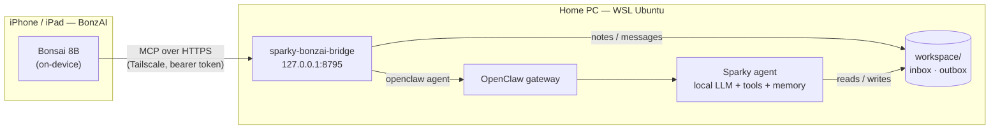

# sparky-bonzai-bridge

An MCP server that lets the small model in the [BonzAI](https://apps.apple.com/us/app/bonzai-local-ai-agent/id6752847988)
app on an iPhone or iPad hand work to **Sparky**, an OpenClaw agent
on a home PC.

The phone model (Bonsai 8B, fully on-device) handles quick, private work. When a
request needs your own data, tools, or a long run, it calls `sparky_ask`, and
Sparky does the work on the PC with his memory, files and GPU.



## What it gives the phone

| Tool | Use it for |
|---|---|
| `sparky_ask` | Hand Sparky a request. Returns the answer, or a `job_id` if it takes longer than about 75 s. |
| `sparky_job_result` | Get a finished job, or list recent jobs. |
| `sparky_note` | Leave Sparky a note that needs no reply. |
| `sparky_inbox` | Read messages Sparky left for this device. |
| `sparky_inbox_ack` | Mark those messages as read. |
| `sparky_status` | Check whether Sparky is online or busy, and whether messages are waiting. |

Why six small tools: the model calling them is a 1-bit 8B running on a phone,
and fewer, plainer tools make it more reliable. See
[docs/on-device-models.md](docs/on-device-models.md) for what the phone model
is actually good at and where the split between phone and PC should fall.

## Quick start

Requirements: WSL2 with systemd, Node 24+, a working OpenClaw install, and
Tailscale on the Windows host.

```bash
git clone https://github.com/Applied-AI-Solutions-hub/sparky-bonzai-bridge.git ~/projects/sparky-bonzai-bridge
cd ~/projects/sparky-bonzai-bridge
npm ci
cp .env.example .env                                  # optional; defaults are sensible
npm run device -- add iphone --label Kit              # prints this device's token once
./deploy/install.sh                                   # systemd user service
```

Then, in Windows PowerShell:

```powershell
tailscale serve --bg --https 8795 http://127.0.0.1:8795
```

In BonzAI, add an MCP server with URL `https://<machine>.<tailnet>.ts.net:8795/mcp`
and header `Authorization: Bearer <token>`. Paste the system prompt from
[bonzai/system-prompt.md](bonzai/system-prompt.md).

Full walkthrough, including the restricted OpenClaw agent and migrating from the
old `sparky-mcp`: [docs/setup.md](docs/setup.md).

## Documentation

- [docs/setup.md](docs/setup.md): install, OpenClaw agent, Tailscale, BonzAI, migration
- [docs/architecture.md](docs/architecture.md): components, request flows, design decisions
- [docs/on-device-models.md](docs/on-device-models.md): what the phone model does and what Sparky does
- [SECURITY.md](SECURITY.md): trust boundaries and threat model
- [openclaw/skills/bonzai-mailbox](openclaw/skills/bonzai-mailbox/SKILL.md): the skill that teaches Sparky the mailbox

## Development

```bash
npm run check      # typecheck + tests
npm start          # run in the foreground
```

Node 24 runs the TypeScript sources directly (type stripping), so there is no
build step. Tests use a fake `openclaw` binary
([tests/fixtures/fake-openclaw.mjs](tests/fixtures/fake-openclaw.mjs)) and a
real MCP client, so they do not touch a live agent.

## License

[MIT](LICENSE)
