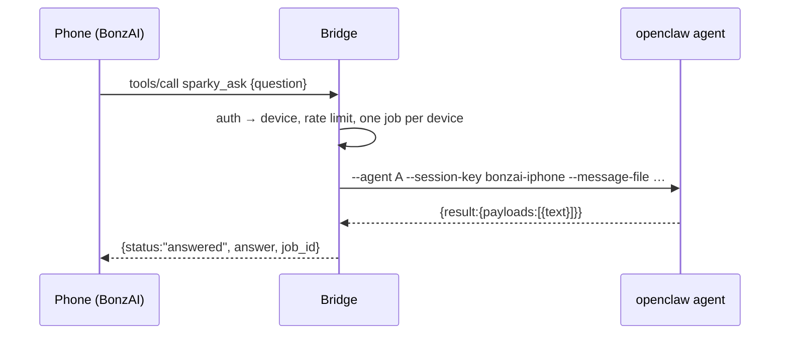

# Architecture

## Components

| Component | Where | Role |
|---|---|---|
| BonzAI | iPhone / iPad | Runs Bonsai 8B on the device; acts as the MCP client |
| Tailscale Serve | Windows host | Provides tailnet-only HTTPS and forwards to `127.0.0.1:8795` |
| **sparky-bonzai-bridge** | WSL (systemd user service) | Stateless MCP server; handles auth, jobs and mailboxes |
| `openclaw` CLI → gateway | WSL | Runs one agent turn in a per-device session |
| Sparky | WSL (OpenClaw agent) | Does the work: model, tools, memory |
| `workspace/inbox/bonzai`, `workspace/outbox/bonzai` | WSL | Plain-file mailboxes both sides can read and write |

WSL2 forwards `127.0.0.1` ports to Windows, so Tailscale on Windows can reach
the bridge without the bridge ever listening on a public interface.

## Request flows

### Synchronous ask



### Slow ask, which becomes a job

If Sparky has not answered within `BRIDGE_ASK_WAIT_SECONDS` (default 75), the
tool returns `{status:"working", job_id}`. The turn keeps running on the PC
and records its result in the job file. The phone collects it later with
`sparky_job_result`. `background: true` skips the wait entirely.

The 75 s default stays under the tool-call timeouts that mobile MCP clients
typically enforce, and still covers most of Sparky's turns.

### Notes and messages

```
phone --sparky_note--> inbox/bonzai/<timestamp>-<device>-<rand>.md --> Sparky (bonzai-mailbox skill)
Sparky --write--> outbox/bonzai/<device>/<file>.md --sparky_inbox--> phone
phone --sparky_inbox_ack--> file moves to outbox/bonzai/<device>/.read/
```

Files, rather than a database, because Sparky already knows how to read and
write files in his workspace. That needs no new OpenClaw tool or plugin, and
you can inspect everything with `ls`.

## Design decisions

**Stateless MCP over Streamable HTTP, JSON responses.** Each POST gets a fresh
`McpServer` bound to the authenticated device. There are no MCP sessions to
lose when the phone sleeps or the service restarts. State that matters (jobs,
mailboxes) is on disk.

**Device identity comes from the token.** Each device has its own token; only
its SHA-256 is stored. The device is looked up from the token on every
request, so a model cannot claim to be another device by passing a parameter.
(The old `sparky-mcp` accepted `device` as a tool argument.)

**One OpenClaw session per device.** `bonzai-<id>` by default, or a custom key
per device (`--session`) to keep an existing conversation history such as
`mcp-kit-iphone`.

**One running job per device.** OpenClaw turns in the same session should not
overlap. A second `sparky_ask` while one is running returns an error that
names the running job, which a small model can act on.

**The message goes to OpenClaw through a file.** `--message-file`, not
`--message`, so there are no argv length limits or quoting issues. The CLI is
spawned with `execFile` (no shell).

**The bridge runs in WSL, next to OpenClaw.** It calls the CLI directly, with
no `wsl.exe` hop or `\\wsl$` path writes from Windows, and runs under the same
systemd sandboxing as the other services.

**TypeScript without a build step.** Node 24 strips types at load time. `tsc`
runs only as a type checker (`npm run typecheck`), and `erasableSyntaxOnly`
keeps the sources runnable.

## Files and state

| Path | Contents |
|---|---|
| `~/.config/sparky-bonzai-bridge/devices.json` | Device ids, labels, token hashes (mode 600) |
| `~/.local/state/sparky-bonzai-bridge/jobs/*.json` | One file per job; pruned after 7 days |
| `~/.local/state/sparky-bonzai-bridge/tmp/` | Message files while a turn runs |
| `~/workspace/inbox/bonzai/` | Notes to Sparky |
| `~/workspace/outbox/bonzai/<device>/` | Messages to a device; `.read/` holds acknowledged ones |

On startup, jobs left `running` by a previous process are marked failed, so a
device is never stuck behind a job that cannot finish.

## Roadmap

- `sparky_ask` option to request a larger hosted model for one turn (`openclaw agent --model`).
- Push to the device when a job finishes, instead of polling.
- Optional read-only project tools, such as work-map search from the command center.
